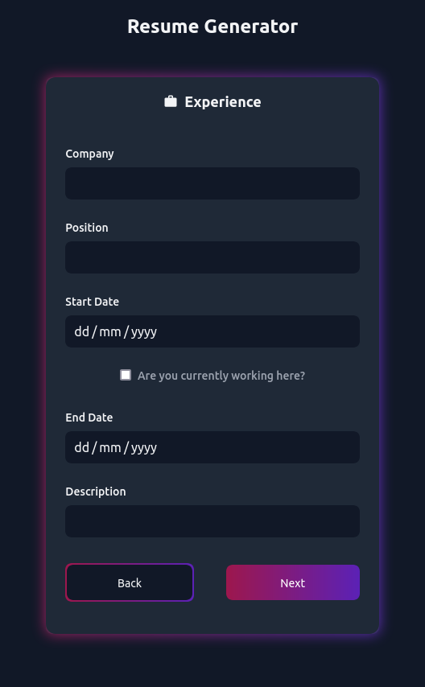

# Resume Generator

A full-stack web application to create resumes.

<p align="center">
  
</p>

## Problem Overview

Creating customized resumes are hard. To solve this, we've developed a webapp that takes in your information once and generates a resume in PDF format that you can download.

To create the resume in a step-by-step manner, we use the `react-albus` library. This provides the user with a wizard like experience. Apart from this, it also supports dynamic routing.

To generate a PDF file, we need server side processing. We chose NodeJS and ExpressJS for their speed, stability, and ease of integration with ReactJS. This allows us to offer a seamless application experience.

Our focus, to style the application, was on speed along with beautiful default options. We chose `styled-compnents` and `TailwindCSS`. `styled-components` allowed us to re-use a lot of code while `TailwindCSS` helped us to iterate faster over our designs. We use `Twin.macro` to get the best of both worlds.

## Technology Stack

### Frontend

The frontend is built using ReactJS. The app is bootstrapped using `create-react-app`. To style the app, we use `TailwindCSS`, `Styled Components`, and `Twin.macro`.

State management is achieved using `Context API` provided by `React`. It helps to maintain a global state which we utilize throughout the application.

API calls are managed using `axios` which makes it easy to send asynchronous HTTP requests to REST endpoints and perform CRUD operations.

`React-toastify` is used to display success/error messages to the user.

Finally, to create the multi-step form, we used `react-albus` developed by Amex.

### Backend

The backend is built using NodeJS and ExpressJS.

### Install

Clone the repo.

```
git clone https://github.com/theairbend3r/resume-generator.git
```

Install frontend dependencies.

```
cd frontend/
npm install
```

Install backend dependencies.

```
cd backend/
npm install
```

Start the frontend server.

```
npm start
```

Start the backend server.

```
npm start
```

The frontend lives at `http://localhost:3000` and the backend lives at `http://localhost:5000`.

### What’s next ?

- Allow users to save the information and edit the resume later.
- Make every step customizable, allow users to add dynamic fields.
- Support multiple/customize resume templates.
